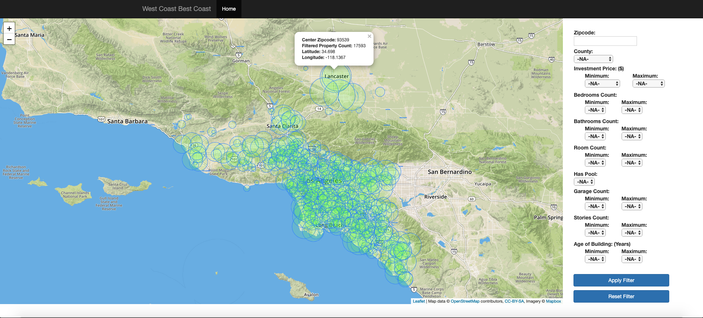
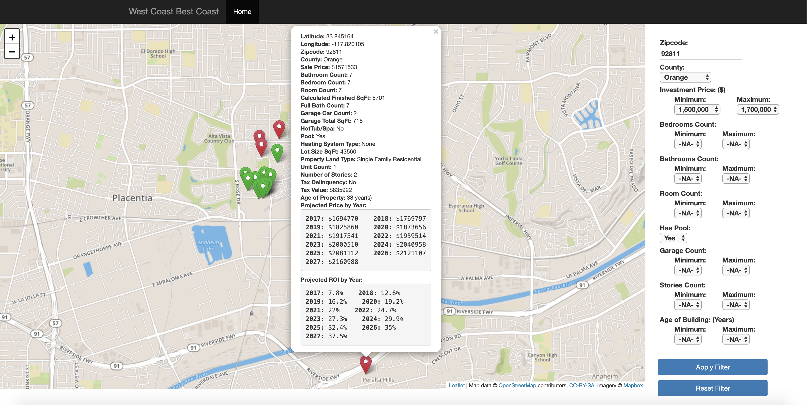
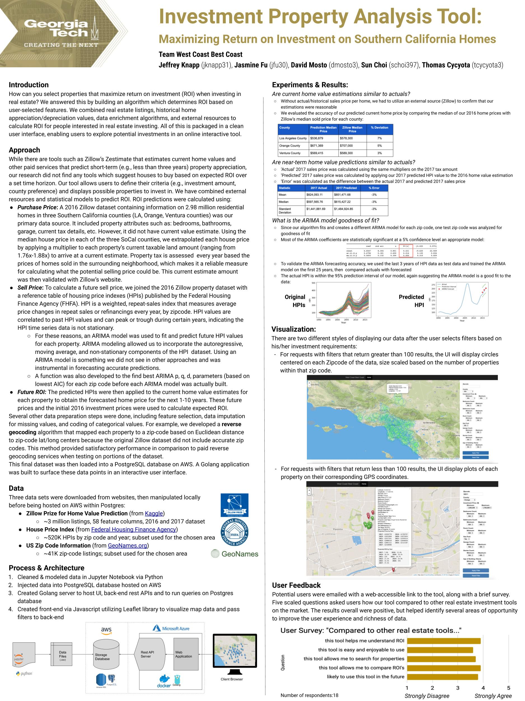

# Property-Investment-ROI-Analysis
Data and Visual Analytics (CSE6242) as part of Georgia Tech Master of Science in Analytics degree.

## Project Purpose
How can you select properties that maximize return on investment (ROI) when investing in
real estate? We answered this by building an algorithm which determines ROI based on
user-selected features. We combined real estate listings, historical home
appreciation/depreciation values, data enrichment algorithms, and external resources to
calculate ROI for people interested in real estate investing. All of this is packaged in a clean
user interface, enabling users to explore potential investments in an online interactive tool.

#### Demo Video:
[Investment Property Analysis Tool on YouTube (3 mins)](https://youtu.be/jqf3ImNxzYc)

## Visualization
There are two different styles of displaying our data after the user selects filters based on his/her investment requirements:
For requests with filters that return greater than 100 results, the UI will display circles centered on each Zipcode of the data, size scaled based on the number of properties within that zip code.

For requests with filters that return less than 100 results, the UI display plots of each property on their corresponding GPS coordinates.

## Final Poster

## Collaboration
This project was completed as a group of very talented data scientists and computer scientists:
- Jasmine Fu
- Sun Choi
- David Mosto
- Jeff Knapp
